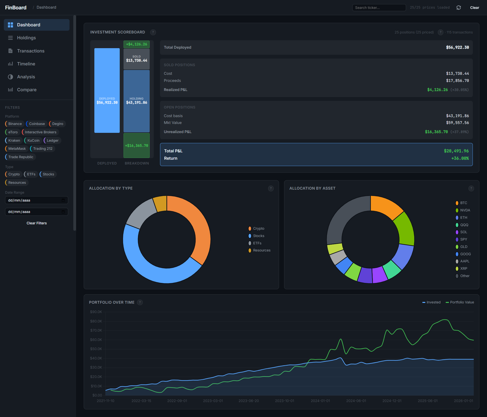
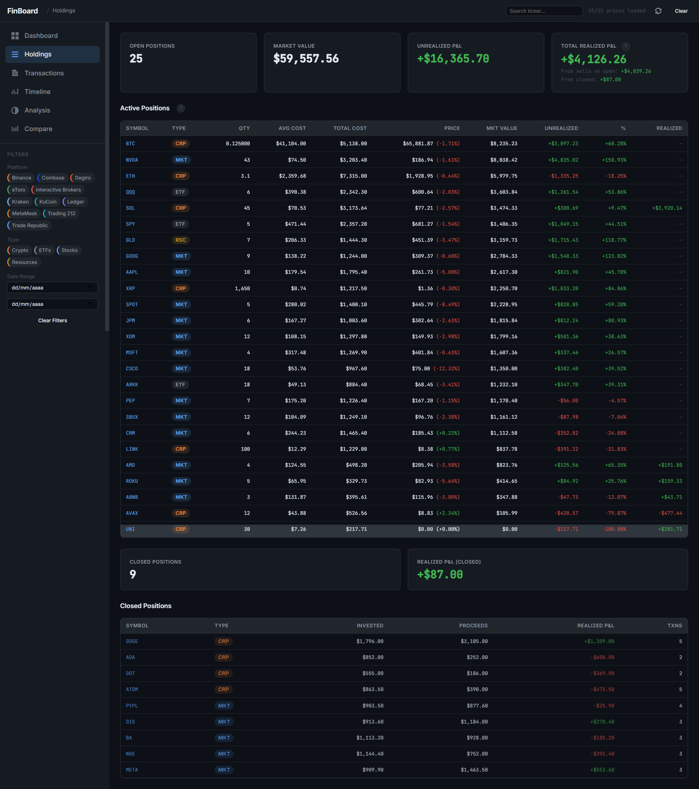
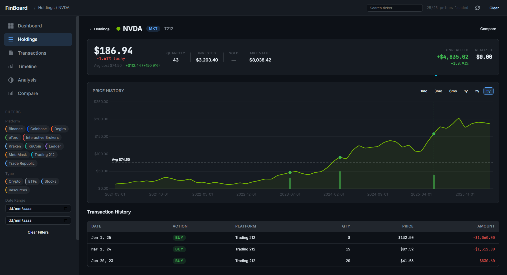
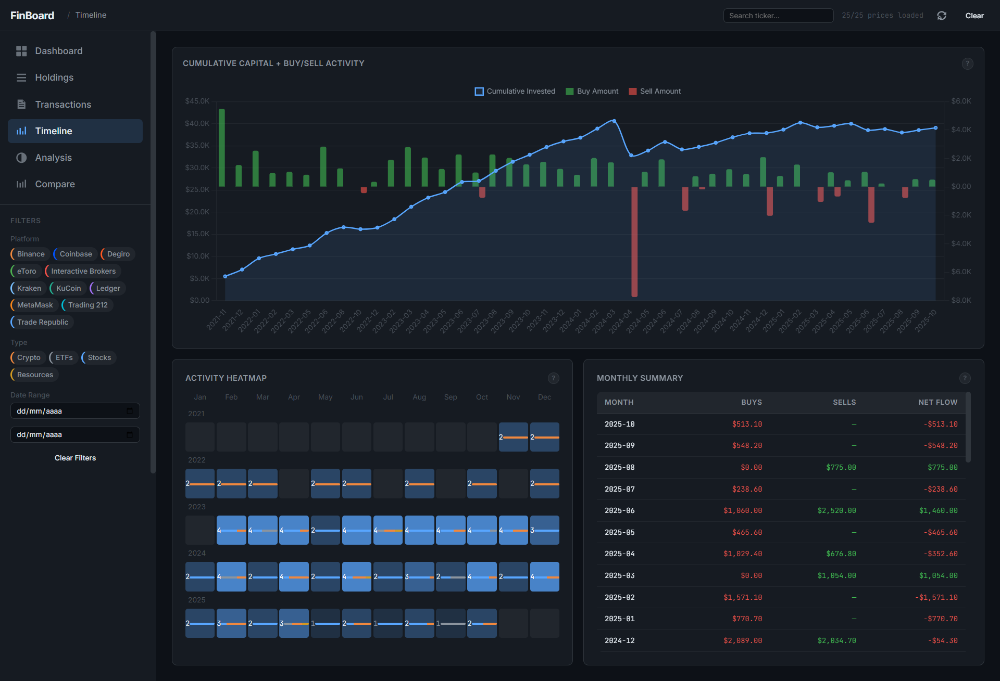
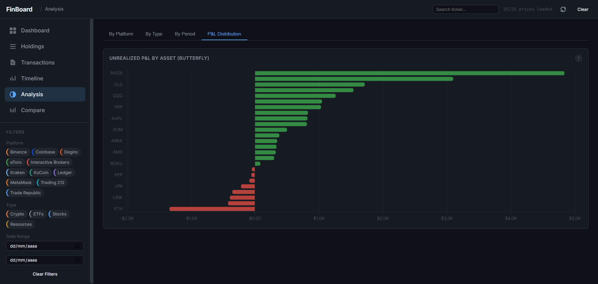
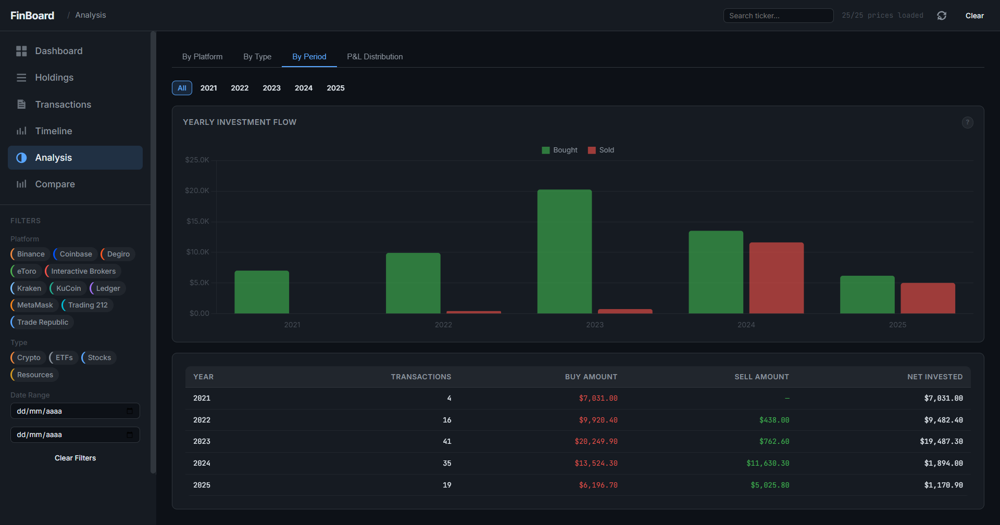
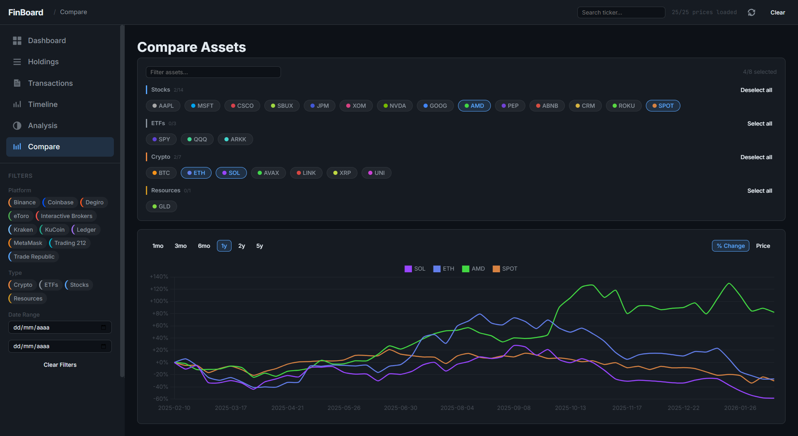

# FinBoard

Personal investment dashboard that turns a pipe-delimited CSV ledger into a live portfolio tracker with real-time prices, P&L, and allocation charts.

Drop in a CSV of your trades (`DATETIME|TYPE|PLATFORM|ACTION|SYMBOL|QUANTITY|PRICE|BALANCE`), and get a live dashboard with holdings, P&L, asset allocation, transaction history, and timeline charts. Pulls real-time prices from Yahoo Finance.

## Screenshots

### Dashboard
Investment scoreboard with total P&L, allocation by type and asset, and portfolio value over time.

### Holdings
All active and closed positions with real-time prices, cost basis, unrealized/realized P&L, and weight.

### Holdings — Asset Detail
Drill into any asset to see its price history, average cost, and full transaction log.

### Timeline
Cumulative capital deployed vs. buy/sell activity, contribution heatmap, and monthly flow summary.

### Analysis — P&L Distribution
Butterfly chart of unrealized P&L per asset, showing winners and losers at a glance.

### Analysis — By Period
Yearly investment flow (bought vs. sold) with a breakdown table by year.

### Compare
Overlay normalized price performance of multiple assets on a single chart.

## Demo data

The dashboard ships with example data hardcoded in `js/demo-data.js` so you can open `index.html` directly and see the UI in action. These are **not** real transactions — they use fictitious platforms (ETOR, DGRO, T212, COBS, KUCN, MTMK) and fabricated amounts.

This is necessary because browsers block local file reads (`file://` protocol) due to CORS, so embedding sample CSV content in JS is the only way to make the demo work without a server.

The `examples/` folder contains the same sample data as standalone `.csv` files for format reference. To use the dashboard with your own data, either:

- Serve the project from a local HTTP server (e.g. `python -m http.server`) and point it at your CSVs, or
- Use the built-in file upload in the dashboard to load your CSV directly.

## Why vanilla JS/HTML/CSS

FinBoard is a single-user tool that reads a local CSV and renders charts -- there's no auth, no database, no server logic, nothing that justifies a build step, a framework, or a backend (you could argue React or Vue would make the UI more maintainable, but at ~4K lines of JS split across clean modules, the complexity never reaches the point where a virtual DOM or reactive state actually pays for itself -- it just adds a transpiler, a node_modules folder, and a build pipeline to something that today is literally a folder you double-click). Vanilla JS/HTML/CSS means the entire app runs from a single `index.html` you can open in a browser, host on GitHub Pages, or drop into Google Drive (yes, this limits you -- no SSR, no route-level code splitting, no TypeScript safety net -- but for a personal dashboard with one user and thirteen views, those are solutions to problems that don't exist). Chart.js is the only external library, loaded via CDN, because writing a charting engine from scratch would be engineering vanity, not engineering value (and if Chart.js ever dies, swapping it for another lib is a weekend -- the rest of the app has zero coupling to it beyond one wrapper file). The constraint is the feature: if it can't be done without a server, it shouldn't be in this tool.
